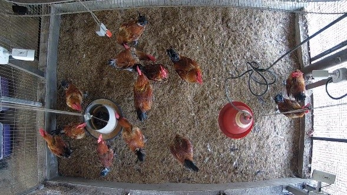
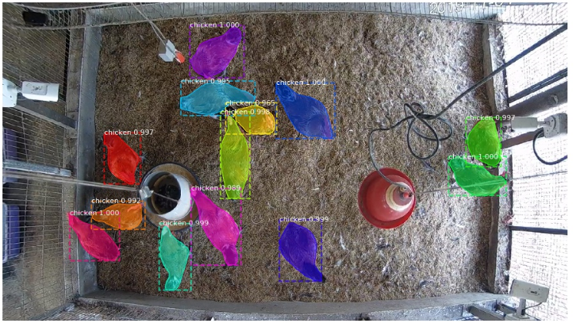

Repo：https://github.com/AlexHsuYu/ClumsyChickens.git

# 簡介
>利用深度學習進行各週期雞隻體重估測，首先透過 IP camera 擷取影像，藉由docker 所架設的nginx-rtmp 伺服器進行影像串流，使用Mask RCNN對於雞隻進行目標檢測與 Deep SORT進行雞隻多目標追蹤，將所獲得的具有時序性質的特徵資料，餵入SVR進行屠齡體重估測所獲得的mean absolute error 為101g，誤差約為5%左右。

